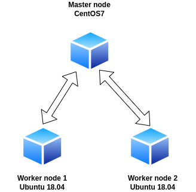

# Simple Jenkins server setup with remote build agents

## Table of content:
1. [Lab environment setup](#lab-environment-setup)
2. [Overview](#overview)
3. [Usage](#usage)
4. [VM machine resource configuration](#vm-machine-resource-configuration)
5. [Jenkins configuration](#jenkins-configuration)
6. [Git configuration](#git-configuration)
7. [Reference](#reference)

## Lab environment setup:  


## Overview:
0. Tested on host machine: Ubuntu 20.04, Vagrant 2.2.19, VirtualBox 6.1.34r150636
1. Jenkins master node: CentOS7, IP: `192.168.56.10`, hostname: `master`, installed Jenkins verion 2.356
2. Build agent (worker nodes): Ubuntu 18.04, IP: `192.168.56.11-[12]`, hostname: `worker1-[2]` 
3. This setup requires manual config of Jenkins server to your need through UI at [http://localhost:8080](http://localhost:8080)
4. Configuration of the Nodes is done via bash scripts in `provision` folder
5. [CentOS7 box](https://app.vagrantup.com/centos/boxes/7)
6. [Ubuntu 18.04 box](https://app.vagrantup.com/ubuntu/boxes/bionic64)
7. All three nodes in private network `192.168.56.1/21` with access to the Internet via NAT

## Usage:
1. Deploy the environment:
```shell
vagrant up
```
To check the deployment of VMs use:
```shell
vagrant global-status --prune
```
2. To SSH into VM:
```shell
vagrant ssh [vm_name]
```
3. To delete environment:
```shell
vagrant destroy
```
For more info check the following article: [Quick startup with Vagrant](https://brain2life.hashnode.dev/quick-startup-with-vagrant)

## VM machine resource configuration:
1. VM configuration is done with `v.customize` option
2. VMs use 2GB and 2CPU
2. Links:
    - [How do I increase the RAM and set up host-only networking in Vagrant?](https://stackoverflow.com/questions/12308149/how-do-i-increase-the-ram-and-set-up-host-only-networking-in-vagrant)

## Jenkins configuration:
1. Configure Jenkins master node at: [http://localhost:8080](http://localhost:8080)
2. The initial Admin password for unlocking Jenkins can be found on master node at:
```shell
sudo cat /var/lib/jenkins/secrets/initialAdminPassword
```
3. Add worker nodes via Jenkins UI. More info at ["How to add Jenkins remote build agent based on Ubuntu 18.04"](https://brain2life.hashnode.dev/how-to-add-jenkins-remote-build-agent-based-on-ubuntu-1804)
4. **Important**: This setup uses SSH password for agent authentication method. Provision script `worker_node.sh` enables SSH password authentication for all worker nodes. For more details see reference points 8 and 9.
5. To add agents specify the following configuration:
    - Remote root directory (`/home/vagrant/jenkins`): `mkdir ~/jenkins`
    - Launch agents via SSH
    - Credentials (`vagrant:vagrant`):
    
    - Host Key Verification Strategy: Non verifying Verification Strategy
6. In Advanced section of Node agent config for `JavaPath` specify `/usr/bin/java` value

## Git configuration:
1. Ensure that [Git plugin](https://plugins.jenkins.io/git/) is installed
2. Ensure that `git` is installed on master and worker nodes
3. Configure path to the `git` executable on master node:
    - Jenkins --> Manage Jenkins--> Global Tool Configuration --> Git --> specify executable path
    
    - To get path use `which git` command
    - To install git on CentOS7 use `sudo yum install git`
4. Configure path on each worker node:
    - Node --> Configure --> Tool locations:
    
5. Links:
    - [[Solution] Git Clone Error: java.io.IOException: error=2, No such file or directory](https://scriptcrunch.com/git-clone-error-java-io-ioexception/)
    - [Jenkins giving error while cloning from gitHub](https://stackoverflow.com/questions/12202078/jenkins-giving-error-while-cloning-from-github)

## Reference:
1. [Vagrant boxes](https://app.vagrantup.com/boxes/search)
2. [Jenkins + Vagrant: Automation, pt 1](https://faun.pub/jenkins-vagrant-automation-pt-1-adae0bdb69d6)
3. [CentOS7 vagrant up fail issue](https://github.com/dotless-de/vagrant-vbguest/issues/399)
4. [How to install Jenkins on CentOS 7 machine](https://brain2life.hashnode.dev/how-to-install-jenkins-on-centos-7-machine)
5. [How to add Jenkins remote build agent based on Ubuntu 18.04](https://brain2life.hashnode.dev/how-to-add-jenkins-remote-build-agent-based-on-ubuntu-1804)
6. [How to execute ssh-keygen without prompt](https://stackoverflow.com/questions/43235179/how-to-execute-ssh-keygen-without-prompt)
7. [Allow two or more vagrant VMs to communicate on their own network](https://stackoverflow.com/questions/24867252/allow-two-or-more-vagrant-vms-to-communicate-on-their-own-network)
8. [Vagrant - Generate an ssh key and output it](https://stackoverflow.com/questions/37729806/vagrant-generate-an-ssh-key-and-output-it)
9. [SSH: How to change value in config file in one command](https://superuser.com/questions/759481/ssh-how-to-change-value-in-config-file-in-one-command)
10. [Jenkins slave unable to figure out java version](https://stackoverflow.com/questions/36126778/jenkins-slave-unable-to-figure-out-java-version)